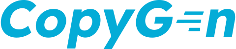

<br>

[](https://github.com/switchupcb/copygen#copygen)

---

[](https://pkg.go.dev/github.com/switchupcb/copygen)
[](https://github.com/switchupcb/copygen/blob/main/LICENSE)
[](https://github.com/avelino/awesome-go#generators)

Copygen is a command-line **code generator** that generates type-to-type and field-to-field code without adding any reflection or dependencies to your project. Manual-copy code generated by Copygen is [**391x faster**](https://github.com/gotidy/copy#benchmark) than **jinzhu/copier**, and adds no allocation to your program. Copygen is the most customizable type-based generator to-date and features a rich yet simple setup. Copygen supports _**every**_ Go type including `basic`, `array`, `slice`, `map`, `chan`, `interface`, and `func` types.

| Topic                           | Categories                                                                         |
| :------------------------------ | :--------------------------------------------------------------------------------- |
| [Usage](#Usage)                 | [Types](#types), [Setup](#setup), [Command Line](#command-line), [Output](#output) |
| [Customization](#customization) | [Custom Objects](#custom-objects), [Templates](#templates)                         |
| [Matcher](#matcher)             | [Automatch](#automatch), [Manual](#manual), [Depth](#depth)                        |
| [Usecases](#usecase)            | [When to Use](#when-to-use-copygen), [Custom Generation](#custom-generation)       |
| [License](#license)             | [What can I do?](#what-can-i-do), [License Exception](#license-exception)          |

## Usage

Each example has a **README**.

| Example                          | Description                              |
| :------------------------------- | :--------------------------------------- |
| main                             | The default example.                     |
| [basic](examples/basic/)         | Matches a `basic` type to a field.       |
| [automatch](examples/automatch/) | Uses the automatch feature with depth.   |
| [map](examples/map/)             | Uses the manual map feature.             |
| [tag](examples/tag/)             | Uses the manual tag feature.             |
| deepcopy _(Roadmap)_             | Uses the deepcopy option.                |
| [error](examples/error/)         | Uses `.go` templates to return an error. |
| [tmpl](examples/tmpl/)           | Uses `.tmpl` templates.                  |
| [program](examples/program/)     | Uses Copygen programmatically.           |

_*[`multi`](examples/_tests/multi/setup/setup.go) tests every type._

This [example](examples/main/) uses three type-structs to generate the `ModelsToDomain()` function using a Command Line Interface.

### Types

The following types are defined in a program.

`./domain/domain.go`

```go
// Package domain contains business logic models.
package domain

// Account represents a user account.
type Account struct {
	ID     int
	UserID string
	Name   string
	Other  string // The other field is not used.
}
```

`./models/model.go`

```go
// Package models contains data storage models (i.e database).
package models

// Account represents the data model for account.
type Account struct {
	ID       int
	Name     string
	Password string
	Email    string
}

// A User represents the data model for a user.
type User struct {
	UserID   int
	Name     string
	UserData string
}
```

The `models.Account` and `models.User` fields will be copied to `domain.Account` fields.

### Setup

Setting up Copygen is a 2-step process involving a `YML` and `GO` file.

#### setup.yml

```yml
# Define where the code will be generated.
generated:
  setup: ./setup.go
  output: ../copygen.go

  # Define the optional custom templates used to generate the file (.go, .tmpl supported).
  template: ./generate.go

# Define custom options (which are passed to generator options) for customization.
custom:
  option: The possibilities are endless.
```

_The main example ignores the template fields._

#### setup.go

Create an interface in the specified setup file with a `type Copygen interface`. In each function, specify _the types you want to copy from_ as parameters, and _the type you want to copy to_ as return values. _This interface is inspired by **goverter**._

```go
/* Specify the name of the generated file's package. */
package copygen

/* Copygen defines the functions that will be generated. */
type Copygen interface {
  // custom see table below for options
  ModelsToDomain(*models.Account, *models.User) *domain.Account
}
```

_Copygen uses no allocation **with pointers** because Go is pass-by-value. Specifying a pointer results in the object's fields being assigned directly; as opposed to a copy of the object's fields._

#### options

You can specify options for your Copygen functions using comments: Do **NOT** put empty lines between comments that pertain to one function. **Options are evaluated in order of declaration.**

| Option              | Use                                                      | Description                                                                                                                                                                        | Example                                                                      |
| :------------------ | :------------------------------------------------------- | :--------------------------------------------------------------------------------------------------------------------------------------------------------------------------------- | :--------------------------------------------------------------------------- |
| `map from to`       | Map fields manually.                                     | Copygen uses its [automatcher](#automatch) by default. <br /> Override this to `map` fields to and from each other. <br /> Regex is supported for from-fields.                     | `map .* package.Type.Field` <br /> `map models.Account.ID domain.Account.ID` |
| `tag field key`     | Map fields manually using tags.                          | Copygen uses its [automatcher](#automatch) by default. <br /> Override this using `tag` with _regex_ and a tag key.                                                                | `tag package.Type.Field key` <br /> `tag .* api` _(all fields)_              |
| `depth field level` | Use a specific field depth.                              | Copygen uses full-field [depth](#depth) by default. <br /> Override this using `depth` with _regex_ and a [depth-level](#depth) integer.                                           | `depth .* 2` <br /> `depth models.Account.* 1`                               |
| `deepcopy field`    | Deepcopy from-fields.                                    | Copygen shallow copies fields by default. <br /> Override this using `deepcopy` with _regex_. <br /> For more info, view [Shallow Copy vs. Deep Copy](#shallow-copy-vs-deep-copy). | `deepcopy package.Type.Field` <br /> `deepcopy .*` _(all fields)_            |
| `automatch field`   | Use the automatcher selectively or with `map` and `tag`. | Using `map` or `tag` disables the default automatcher. <br /> Enable it using `automatch` with _regex_. <br />                                                                     | `automatch package.Type.Field` <br /> `automatch models.User.*`              |
| `custom option`     | Specify custom function options.                         | Use custom options with [templates](#templates). <br /> Returns `map[string][]string` _(trim-spaced)_.                                                                             | `ignore true` <br /> `swap false`                                            |

_[View a reference on Regex.](https://cheatography.com/davechild/cheat-sheets/regular-expressions/)_

#### Convert

In certain cases, you may want to specify a how a specific type or field is copied with a function. This can be done by defining a function with a `convert` option.
```go
/* Define the function and field this converter is applied to using regex. */
// convert .* models.User.UserID
// Itoa converts an integer to an ascii value.
func Itoa(i int) string {
	return c.Itoa(i)
}
```

### Command Line

Install the command line utility: Copygen is an executable and not a dependency, so use `go install`.

```
go install github.com/switchupcb/copygen@latest
```

Install a specific version by specifying a branch.
```
go install github.com/switchupcb/copygen@main
```

Install a specific version by specifying a tag.
```
go install github.com/switchupcb/copygen@v0.3.8
```

Run the executable with given options.

```bash
# Specify the .yml configuration file.
copygen -yml path/to/yml
```

_The path to the YML file is specified in reference to the current working directory._

### Output

This example outputs a `copygen.go` file with the specified imports and functions.

```go
// Code generated by github.com/switchupcb/copygen
// DO NOT EDIT.

// Package copygen contains the setup information for copygen generated code.
package copygen

import (
	c "strconv"

	"github.com/switchupcb/copygen/examples/main/domain"
	"github.com/switchupcb/copygen/examples/main/models"
)

// Itoa converts an integer to an ascii value.
func Itoa(i int) string {
	return c.Itoa(i)
}

// ModelsToDomain copies a *models.Account, *models.User to a *domain.Account.
func ModelsToDomain(tA *domain.Account, fA *models.Account, fU *models.User) {
	// *domain.Account fields
	tA.ID = fA.ID
	tA.UserID = Itoa(fU.UserID)
	tA.Name = fA.Name
}
```

## Customization

Copygen's method of input and output allows you to generate code not limited to copying fields.

### Custom Objects

Custom types external to your application can be created for use in the `setup.go` file. When a file is generated, all types _(structs, interfaces, funcs)_ are copied **EXCEPT** the `type Copygen interface`.

```go
type DataTransferObject struct {
  // ...
}

type Model interface {
  // ...
}

func New() {
  // ...
}
```

### Shallow Copy vs. Deep Copy

The library generates a [shallow copy](https://en.m.wikipedia.org/wiki/Object_copying#Shallow_copy) function by default. An easy way to deep-copy fields with the same return type is by using `new()` as or in a converter function **or** by using a custom template.

### Templates

Copygen supports three methods of code generation: `.go`, `.tmpl`, and `programmatic`. View the [models.Generator](cli/models/generator.go) type for context on the parameters passed to each function. Generator options are parsed from the YML configuration file. Function options are parsed from `custom` options. Any other option represents a `FieldOption`.

#### .go

Use `.go` files to customize the code generation algorithm. The `copygen` generator uses the [`package template Generate(*models.Generator) (string, error)`](cli/generator/template/generate.go) to generate code. As a result, **this function is required** for your `.go` templates to work. The [error example](examples/error/) modifies the `.yml` in order to use **custom `.go` template functions** that `return error`. The [`template/generate.go`](/cli//generator/template/generate.go) file provides the default code generation algorithm for generating code.

_Use of non-extracted Go Module Imports in [`generate.go` template files](cli/generator/template/generate.go) are unsupported at the current time._

#### .tmpl

Use `.tmpl` _([`text/templates`](https://pkg.go.dev/text/template))_ to customize the code generation algorithm. The [template example](examples/tmpl/) uses a [`.tmpl`](/examples/tmpl/template/generate.tmpl) file to generate code.

#### programmatic

Use `copygen` as a third-party module in your application. For more information, read the [program example](/examples/program/README.md).

## Matcher

Copygen provides two methods of field-matching: `automatch` and `manual`.

_Disable the matcher from the command-line using `-xm` or programmatically by setting `Enviroment.DisableMatcher` = true._

### Automatch

When fields aren't specified using [options](#options), Copygen will attempt to automatch type-fields by name and definition. Automatch will match one from-field to many to-fields. **Automatch supports field-depth** (where types are located within fields) **and recursive types** (where the same type is in another type). Automatch loads types from Go modules _(in GOPATH)_: Ensure your modules are up to date by using `go get -u <insert/module/import/path>`.

### Manual

Using the `map` or `tag` option disables the automatcher, which allows you to manually match fields. In order to re-enable the automatcher, use the `automatch` option. Options are evaluated in order of declaration, so using `automatch .*` **after** declaring `map` and `tag` options provides an easy way to re-enable the _automatcher_ for remaining fields.

#### Depth

The automatcher uses a field-based depth system. A field with a depth-level of 0 will only match itself. Increasing the depth-level allows its sub-fields to be matched. This system allows you to specify the depth-level for whole types **and** specific fields.

```go
// depth-level in relation to the first-level field (0).
type Account
  // 1
  ID      int
  Name    string
  Email   string
  Basic   domain.T // int
  User    domain.DomainUser
              // 2
              UserID   string
              Name     string
              UserData map[string]interface{}
  // 1
  Log     log.Logger
              // 2
              mu      sync.Mutex
                          // 3
                          state   int32
                          sema    uint32
              // 2
              prefix  string
              flag    int
              out     io.Writer
                          // 3
                          Write   func(p []byte) (n int, err error)
              buf     []byte
```

## Usecase

#### When to Use Copygen

Copygen's main purpose is to save you time by generating boilerplate code to map objects together.

#### Why would I do that?

In order to keep a program adaptable _(to new features)_, a program may contain two types of models. The first type of model is the **domain model** which is **used throughout your application** to model its business logic. For example, the [domain models of Copygen](cli/models/) focus on field relations and manipulation. In contrast, the ideal way to store your data _(such as in a database)_ may not match your domain model. In order to amend this problem, you create a **data model**. The [data models of Copygen](cli/config/models.go) are located in its configuration loader. In many cases, you will need a way to map these models together to exchange information from your data-model to your domain _(and vice-versa)_. It's tedious to repeatedly do this in the application _(through assignment or function definitions)_. Copygen solves this problem.

#### Custom Generation

Copygen's customizability with templates allows you to generate any code **based on types** _(and their respective fields, tags, etc)_. 

| Example | Description                                                                             |
| :------ | :-------------------------------------------------------------------------------------- |
| Repogen | Generate a Business-Logic Repository package based on a Data Access Object (DAO) model. |
| Wrapper | Generate functions for requests using an API resource and request object model.         |

## License

Copygen uses a [GPLv3 License](https://www.gnu.org/licenses/gpl-3.0.en.html). An exception is provided for template and example files, which are licensed under the [MIT License](cli/generator/template/LICENSE.md).

### What can I do?

**Code generated by Copygen can be used without restriction (including proprietary and commercial usage)** since generated code is not considered a derivative work. In contrast, **modifications** to the _Copygen Software Source Code_ and/or implementing Copygen in a larger work **programmatically** requires you to [adhere to the GPLv3 License](https://www.gnu.org/licenses/gpl-faq.html). These restrictions do **NOT** apply to template or example files, as long as those files don't generate Copygen itself.

### License Exception

A license exception allows you to modify and/or use Copygen programmatically **without restriction**. In order to purchase a license exception, please contact SwitchUpCB using the [Copygen License Exception Inquiry Form](https://switchupcb.com/copygen-license-exception/).

## Contributing

You can contribute to this repository by viewing the [Project Structure, Code Specifications, CI/CD, and Roadmap](CONTRIBUTING.md).
